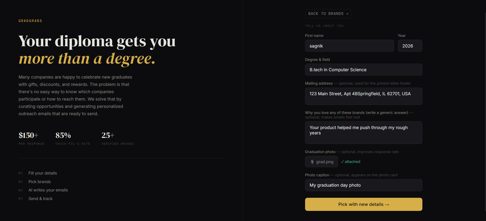
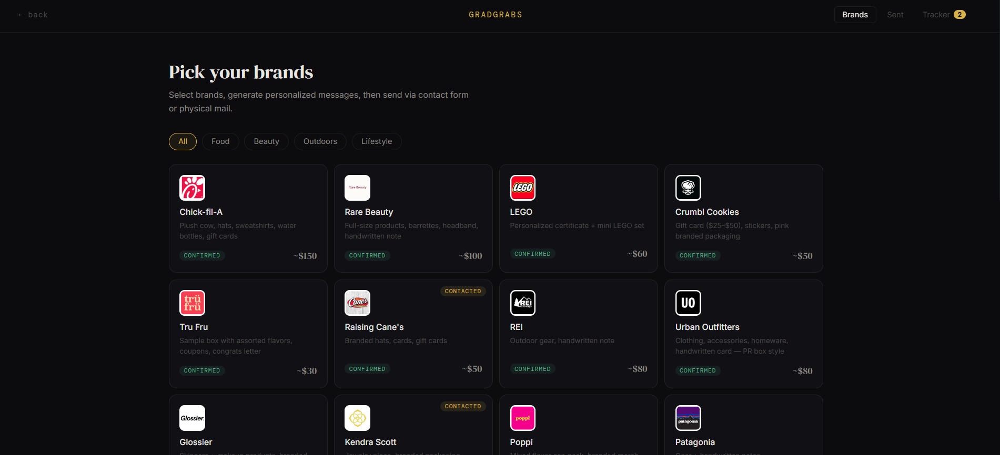
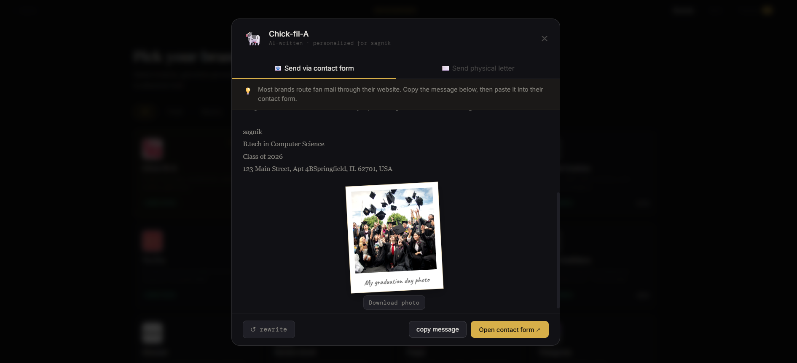

# 🎓 GradGrabs

> Graduate once. Benefit everywhere.

Many companies celebrate new graduates with gifts, discounts, rewards, and special offers. The problem? Most students don't know which companies participate, where to contact them, or what to write.

GradGift solves this by helping graduates discover companies that offer graduation rewards and automatically generating personalized outreach emails that are ready to send.

---

## 🚀 The Problem

Every year, thousands of students graduate and become eligible for exclusive offers from various brands and companies.

Unfortunately:

- Information about these programs is scattered across the internet.
- Many opportunities are hidden behind support pages or marketing campaigns.
- Students often don't know who to contact.
- Writing personalized outreach emails for multiple companies is time-consuming.

As a result, many graduates miss out on rewards they could have claimed.

---

## 💡 The Solution

GradGift is a platform that:

- Curates companies that offer graduation gifts, discounts, and rewards.
- Finds relevant contact information.
- Generates personalized outreach emails using AI.
- Makes it easy for graduates to discover and claim available perks.

Instead of spending hours researching and writing emails, graduates can start reaching out in minutes.

---

## ✨ Features

- 🎓 Graduation reward discovery
- 🏢 Curated company database
- ✉️ AI-generated personalized emails
- 📋 Copy-ready outreach templates
- 📱 Responsive web interface

---

## 🛠️ Tech Stack

### Frontend
- React
- Vite
- Tailwind CSS

### AI & Automation
- Gemini API (email generation and personalization)

### Deployment
- Vercel

---

## ⚙️ How It Works

1. Enter your graduation details.
2. Browse participating companies.
3. Select a company you'd like to contact.
4. Generate a personalized outreach email.
5. Copy, send, and wait for a response.

---

## 📸 Screenshots

### Home Page


### Company Search


### Email Generator


---

## 🎯 Target Users

- College students
- University graduates
- Recent alumni
- Career starters

---

## 🌍 Impact

Graduates often leave valuable opportunities on the table simply because they don't know they exist.

GradGift removes the research and writing barriers, helping students unlock rewards, discounts, and gifts they've already earned through their academic achievements.

---

## 🔮 Future Roadmap

- Direct email sending
- Reward claim dashboard
- Graduation verification
- More company integrations
- Personalized recommendations

---

## 🚀 Getting Started

### Clone the repository

```bash
git clone https://github.com/yourusername/gradgift.git
cd gradgift
```

### Install dependencies

```bash
npm install
```

### Configure environment variables

Create a `.env` file:

```env
VITE_GEMINI_API_KEY=your_api_key

```

### Start development server

```bash
npm run dev
```

---

## 👥 Team

Built during a hackathon to help graduates discover and claim benefits they might otherwise miss.

---

## 📜 License

MIT License
